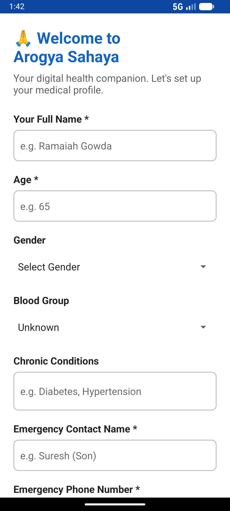
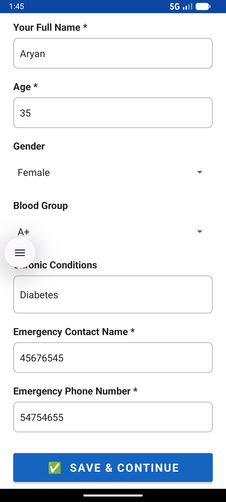
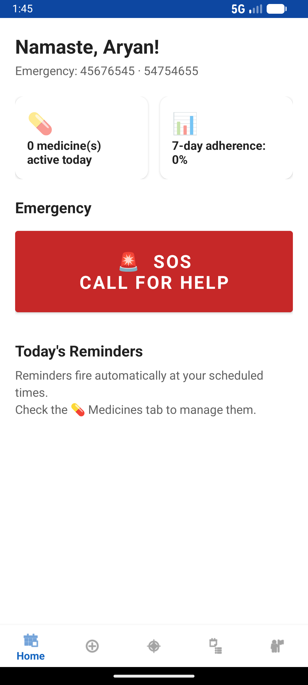
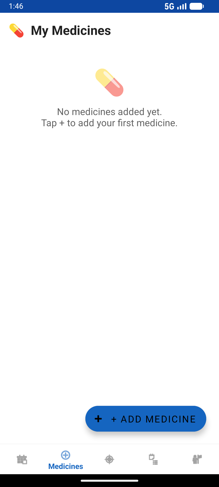
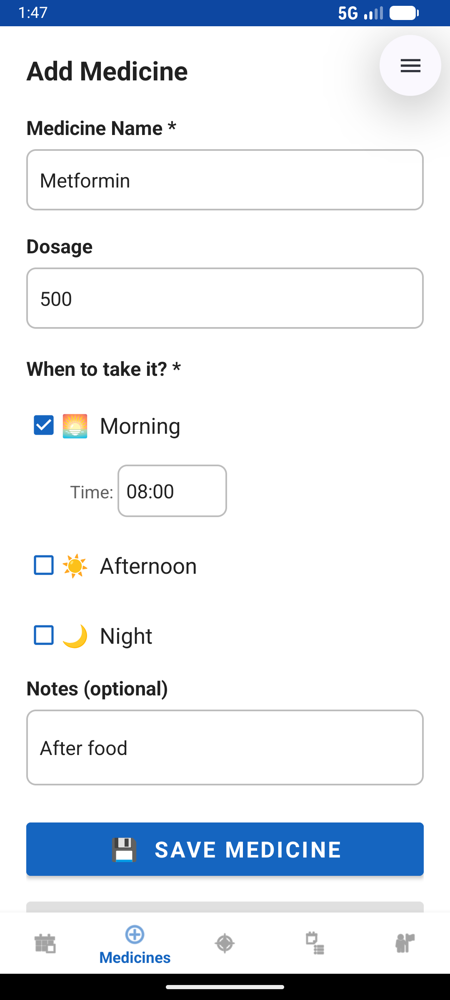
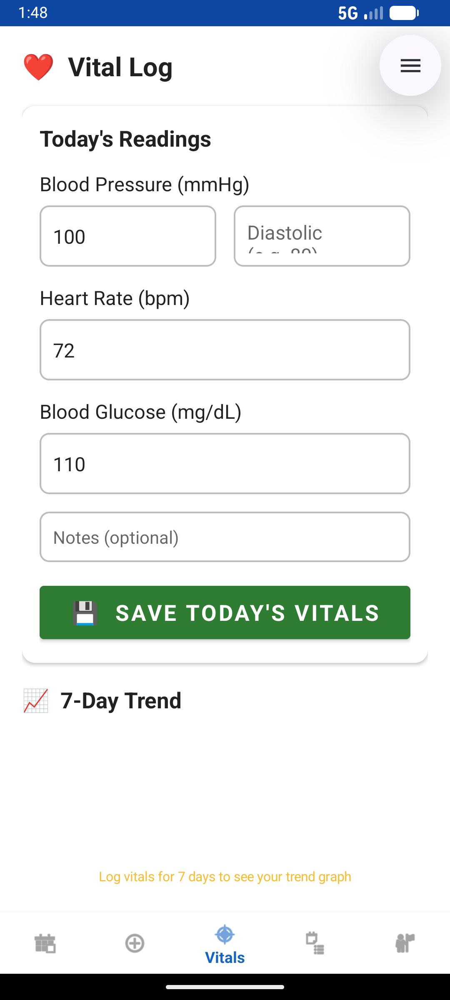
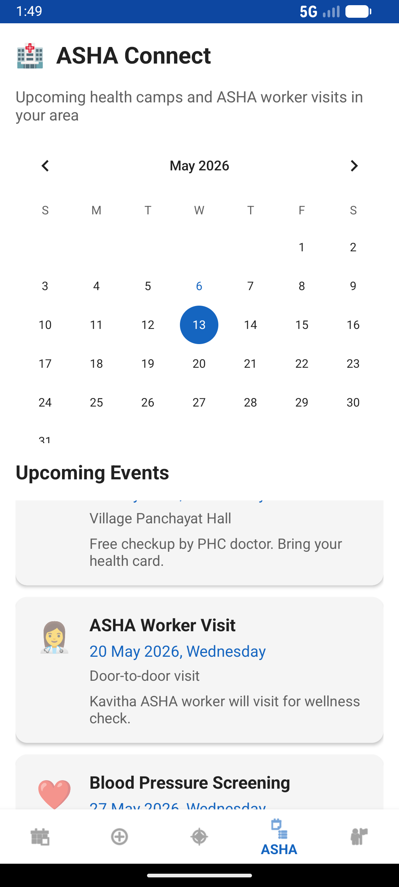
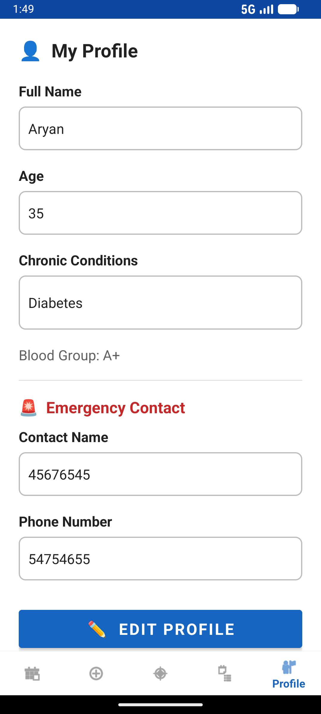
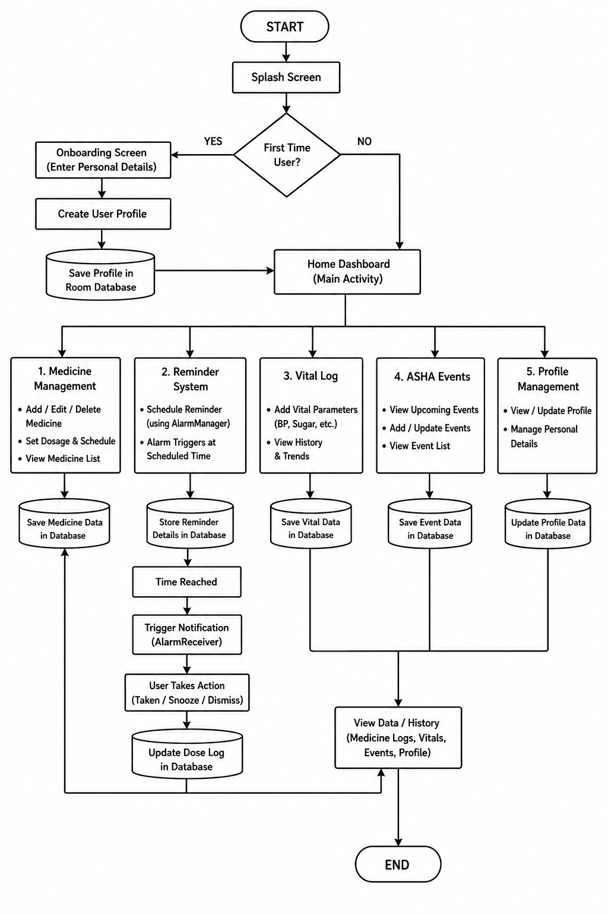

# 🩺 ArogyaSahaya

ArogyaSahaya is a smart healthcare and medication management Android application developed using Kotlin and MVVM architecture. The application helps users manage medicines, receive medication reminders, track vital health parameters, maintain emergency contact information, and access ASHA-related healthcare events in a single platform.

---

# 📱 Features

## 💊 Medicine Management
- Add, edit, and delete medicines
- Set dosage schedules
- Morning, afternoon, and night reminders
- Medication adherence tracking

## ⏰ Reminder System
- Exact medicine reminders using AlarmManager
- Notification alerts even when app is closed
- Scheduled medicine intake tracking

## ❤️ Vital Health Tracking
- Log blood pressure readings
- Track heart rate
- Monitor blood glucose levels
- Maintain daily health records

## 🚨 Emergency Support
- Emergency SOS section
- Emergency contact management

## 🏥 ASHA Connect
- View ASHA worker visits
- Upcoming health camps
- Community healthcare event updates

## 👤 Profile Management
- Store personal health details
- Blood group information
- Chronic condition management
- Emergency contact details

---

# 🛠️ Tech Stack

| Technology | Purpose |
|---|---|
| Kotlin | Main programming language |
| XML | UI Design |
| MVVM Architecture | Application architecture |
| Room Database | Local offline storage |
| Hilt | Dependency Injection |
| AlarmManager | Medicine reminder scheduling |
| BroadcastReceiver | Notification triggering |
| RecyclerView | Dynamic list display |
| Navigation Component | Fragment navigation |
| MPAndroidChart | Vital trend visualization |
| Coroutines | Asynchronous operations |
| ViewBinding | Safe UI binding |

---

# 🏗️ Architecture

The application follows the MVVM (Model-View-ViewModel) architecture.

```text
View → UI Layer
ViewModel → Business Logic
Model → Room Database & Repository
```

This architecture improves:
- Code maintainability
- Scalability
- Separation of concerns
- Lifecycle awareness

---

# 🗂️ Project Structure

```text
ArogyaSahaya/
│
├── app/
├── data/
├── ui/
├── repository/
├── viewmodel/
├── database/
├── screenshots/
├── README.md
└── build.gradle
```

---

# ⚙️ System Workflow

```text
User Opens App
        ↓
Onboarding & Profile Setup
        ↓
Dashboard
        ↓
Add Medicines & Schedule Reminders
        ↓
AlarmManager Triggers Notifications
        ↓
User Takes Medicine
        ↓
Update Logs & Vital Records
```

---

# 📸 Application Screenshots

## 🔹 User Onboarding and Profile Setup



---

## 🔹 User Profile Save Interface



---

## 🔹 Home Dashboard



---

## 🔹 Medicine Management Interface



---

## 🔹 Add Medicine Screen



---

## 🔹 Vital Health Logging Interface



---

## 🔹 ASHA Connect Interface



---

## 🔹 Profile Management Interface




---

# 🔄 Flowchart



---

# 📦 Installation

## Clone Repository

```bash
git clone https://github.com/YOUR_USERNAME/ArogyaSahaya.git
```

---

## Open in Android Studio
- Open Android Studio
- Select "Open Existing Project"
- Choose the cloned project folder

---

## Sync Gradle
Allow Gradle dependencies to download.

---

## Run Application
Connect emulator/device and run the project.

---

# 📋 Requirements

| Requirement | Version |
|---|---|
| Android Studio | Hedgehog / Koala or above |
| Kotlin | 1.9+ |
| Java | JDK 17 |
| Minimum SDK | 24 |
| Target SDK | 34 |

---

# 🚀 Future Scope

- Firebase Cloud Integration
- AI-Based Health Prediction
- Doctor Consultation Module
- Wearable Device Integration
- Cloud Backup & Sync
- Multi-language Support

---

# ✅ Advantages

- Easy medicine management
- Reduces missed doses
- Offline functionality
- User-friendly interface
- Organized health tracking
- Emergency healthcare support

---

# ⚠️ Limitations

- No cloud synchronization
- Local database only
- No real-time doctor integration
- Limited analytics features

---

# 👨‍💻 Developed Using

- Android Studio
- Kotlin
- Room Database
- MVVM Architecture
- Hilt Dependency Injection

---

# 📄 License

This project is developed for educational and academic purposes.

---

# 🙏 Acknowledgement

This project was developed as part of academic learning and Android application development practice in the healthcare domain.
